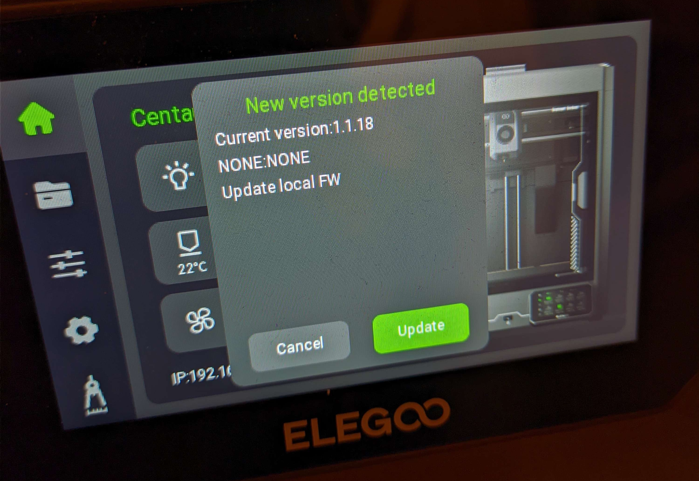
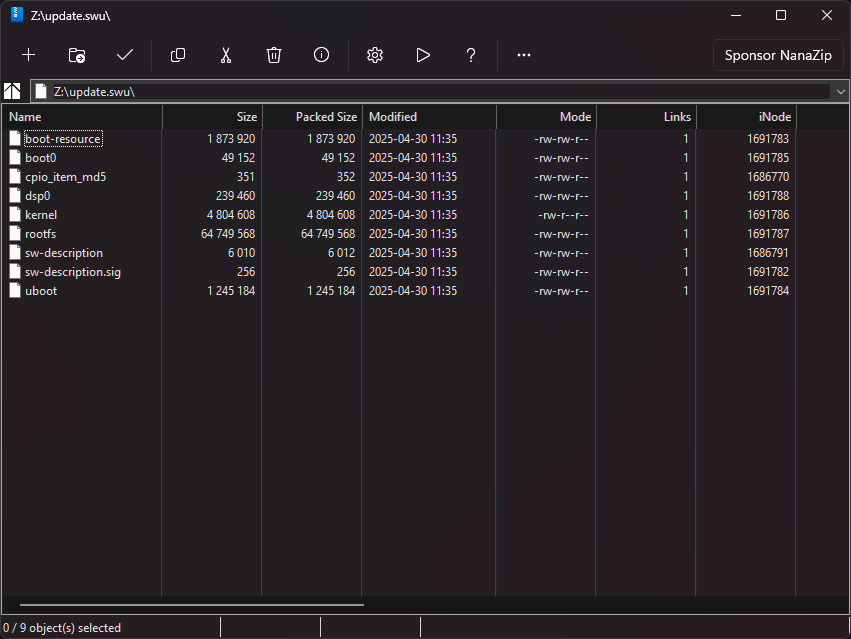

# Updates

The Centauri Carbon during startup checks [an endpoint on chituiot.com](https://mms.chituiot.com/mainboardVersionUpdate/getInfo.do7?machineType=ELEGOO%20Centauri%20Carbon&machineId=0&version=1.1.0&lan=en&firmwareType=1) to check if a new firmware update is available.

## Updating locally (via USB)

1. Download a firmware from one of the packageUrl's in the [Firmware update archive](#firmware-update-archive) section.
2. Rename the just downloaded file to `update.bin`.
3. Plug in a USB thumb drive and put `update.bin` on the root of the USB.
4. Plug the USB into the Centauri Carbon and power it on.
5. Accept the update prompt.

{ width="400" }
/// caption
Credit to Sims on the OpenCentauri Discord.
///

Note: Instead of using `update.bin`, you can also use `update/update.swu`.

## Decrypting & Unpacking updates

1. Download a firmware from one of the packageUrl's in the [Firmware update archive](#firmware-update-archive) section.
2. Run [the unpack.py python script](../assets/unpack.py) to unpack the update
    - Usage: `python unpack.py <filename> <key> <iv>`
3. You will get an `update.swu` file. You can open this file in 7zip. This archive contains all partitions that will be replaced during an update.

{ width="400" }
/// caption
Credit to Sims on the OpenCentauri Discord.
///

The Centauri Carbon makes use of an A/B partition scheme. When an update is applied, the update is applied to the inactive slot. After the update is applied, the machine switches A/B around so the next boot uses the previously inactive slot. The Centuari Carbon makes use of `swupdate` for updates.

Internally, the following commands are used, where %s is the path to the .swu file:

- A->B: `swupdate -i %s -e stable,now_A_next_B -k /etc/swupdate_public.pem -p reboot &`
- B->A: `swupdate -i %s -e stable,now_B_next_A -k /etc/swupdate_public.pem -p reboot &`

## Firmware update archive

### v1.1.25 (Released 9/05/2025)
```json
{
    "code": "000000",
    "messages": null,
    "data": {
        "update": true,
        "version": "1.1.25",
        "packageUrl": "https://download.chitubox.com/chitusystems/chitusystems/public/printer/firmware/release/1/ca8e1d9a20974a5896f8f744e780a8a7/1/1.1.25/2025-05-09/219b4c9e67de4a1d99c7680164911ab5.bin",
        "firmwareType": 1,
        "packageHash": "cba67e65b6b6cf313c4725fd0e545cb8",
        "updateStrategy": 1,
        "log": "Fixes：\n1. Fixed occasional abnormal activation timing issues with the chassis fan and auxiliary fan.\n2. Resolved anomalies in time-lapse photography generation and export functionality.\n3. Optimized material handling processes during feeding/retraction operations.\n4. Addressed unresponsive errors and improved stability in the web interface.\n5. Mitigated miscellaneous issues impacting overall system reliability.",
        "timeMS": 1746814513456,
        "dataInfoId": "7662684858844806bdab03184477fb6e"
    },
    "success": true
}
```

### v1.1.18 (Released 31/03/2025)
```json
{
    "code": "000000",
    "messages": null,
    "data": {
        "update": true,
        "version": "1.1.18",
        "packageUrl": "https://download.chitubox.com/chitusystems/chitusystems/public/printer/firmware/release/1/ca8e1d9a20974a5896f8f744e780a8a7/1/1.1.18/2025-03-31/74406d43dc314af7a174dba70487ac2b.bin",
        "firmwareType": 1,
        "packageHash": "ab50592f9c7bbac725b7c75ff1213fc0",
        "updateStrategy": 1,
        "log": "Fixes：\n1. Fixed flickering issue in the video stream.\n2. Added Korean to the language options.\n3. Fixed several UI logic bugs.\n4. Fixed an issue where time-lapse videos couldn't be exported or generated in some cases.\n5. Fixed abnormal strain gauge detection during printing.\n6. Adjusted the extruder position after stopping a print.\n7. Resolved an issue where the printer could get stuck at the target temperature and fail to start the print.",
        "timeMS": 1746044457465,
        "dataInfoId": "a4d7da0841de41428484f7a17529ebce"
    },
    "success": true
}
```